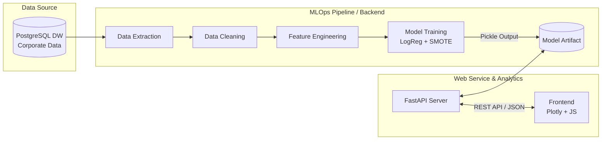
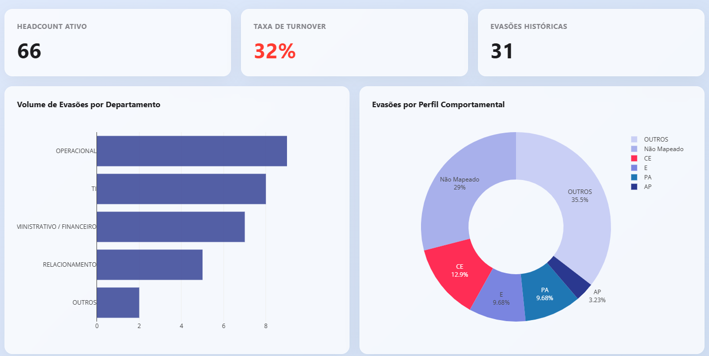
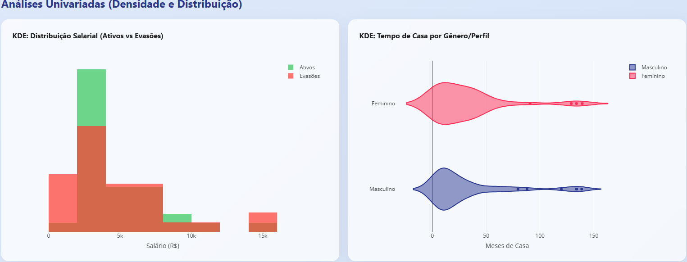
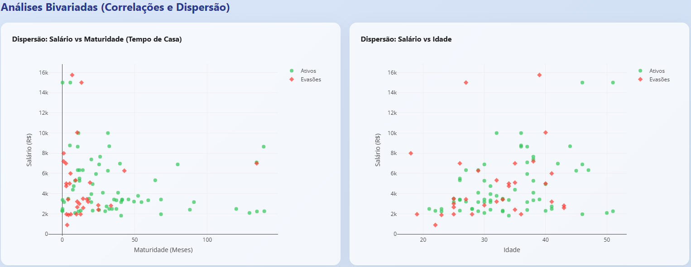

# 📊 Arq People Analytics: Turnover Preditivo


[](https://arq-people-analytics-platform.onrender.com)

Uma plataforma end-to-end de People Analytics focada em prever e mitigar a evasão de talentos...

---

## 🎯 1. The Problem (O Problema)
O Turnover oculto sangra o caixa das empresas. Tradicionalmente, o RH atua de forma **reativa**: a gestão de pessoas só entra em cena *depois* que o talento já entregou a carta de demissão. O custo de reposição, perda de capital intelectual e quebra de produtividade são incalculáveis.

**A Solução:** Inverter o jogo para uma atuação **preditiva**. Esta plataforma ingere dados históricos do Data Warehouse corporativo, treina um modelo de inteligência artificial para identificar padrões de evasão e entrega para os Business Partners uma *Target List* em tempo real: os colaboradores com maior risco de saída, permitindo ações de retenção antes que o pior aconteça.

---

## 🏗️ 2. Architecture (A Arquitetura)
O sistema não é um simples script analítico, mas um microsserviço completo com esteira de MLOps acoplada. Toda a extração, limpeza, engenharia de features e retreino acontecem em background, isolados da camada de visualização.


---

## 🗄️ 3. Data Model (Modelo de Dados)
A origem dos dados é uma OBT *(One Big Table)* extraída de uma View consolidada **(`vw_obt_turnover_lr`)** no Data Warehouse da empresa.
As principais dimensões englobam:

- **Demografia:** Idade, Gênero, Estado Civil.

- **Organização:** Departamento, Tempo de Casa (Maturidade), Escolaridade.

- **Comportamental:** Perfil Solides (Comunicador, Executor, Planejador, Analista).

- **Financeiro/Benefícios:** Salário Contratual, Quantidade de Dependentes.

- **Target:** `target_pediu_demissao` (Variável Binária).
---

## 🧠 4. Analytics & Machine Learning (O Motor)
A abordagem de IA foi construída com foco em **Explicabilidade (XAI)**, para que o RH confie nos resultados.

- **Algoritmo Base:** Regressão Logística (solver='liblinear'). Diferente de modelos "caixa preta", a Regressão Logística nos dá os pesos exatos de cada variável no risco de saída.

- **Desbalanceamento de Classes:** Como (felizmente) há mais colaboradores ativos do que demissões, utilizamos ***SMOTE (Synthetic Minority Over-sampling Technique)*** nativo do `imbalanced-learn` no pipeline, além do hiperparâmetro `class_weight='balanced'`.

- **Feature Engineering:** Agrupamento de perfis com baixa volumetria, criação de flags binárias para departamentos críticos e cálculo de Tenure (Tempo de Casa) automatizado pela data de corte.

---
## 💻 5. Results & UI (Vitrine de Dados)
O Frontend foi construído sem frameworks pesados, utilizando HTML5, CSS3 avançado (Glassmorphism/Apple-like UX) e JavaScript Vanilla conectando com **Plotly.js** para renderização gráfica no lado do cliente, aliviando o servidor.

- **Análise Univariada e Bivariada:** KDE Plots de distribuição salarial, Boxplots de idade vs gênero e Dispersão de maturidade.

- **Target List:**  Exportação em CSV dos top 50 colaboradores com maior risco probabilístico de evasão.

### Visão Geral (Tela Inicial)


### Análise Univariada


### Análise Bivariada


---

## 🚀 6. How to Run (Como Executar o Megazord)

**Pré-requisitos:** Python 3.10+ e um banco de dados PostgreSQL rodando a view do projeto.
1. **Clone o repositório:**
```bash
git clone [https://github.com/SeuUsuario/arq-people-analytics.git](https://github.com/SeuUsuario/arq-people-analytics.git)
cd arq-people-analytics
```

2. **Crie e ative o ambiente virtual:**
````bash
python -m venv venv
# No Windows:
.\venv\Scripts\activate
# No Linux/Mac:
source venv/bin/activate
````

3. **Instale as dependências necessárias:**
````bash
pip install -r requirements.txt
````

4. **Configure as Variáveis de Ambiente:**
Crie um arquivo `.env` na raiz do projeto com as credenciais do seu DW:
````bash
DB_USER=seu_usuario
DB_PASS=sua_senha
DB_HOST=seu_servidor
DB_PORT=5432
DB_NAME=seu_banco
````

5. **Inicie o Servidor:**
```bash
uvicorn server:app --host 0.0.0.0 --port 8000 --reload
```

Acesse `http://localhost:8000` no seu navegador e desfrute.